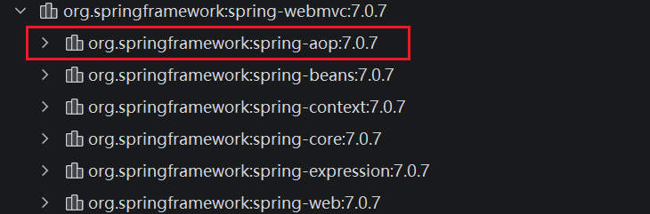

## Spring 常用的依赖

```xml

<dependency>
    <groupId>org.springframework</groupId>
    <artifactId>spring-webmvc</artifactId>
    <version>7.0.7</version>
    <scope>compile</scope>
</dependency>

<dependency>
<groupId>org.springframework</groupId>
<artifactId>spring-jdbc</artifactId>
<version>7.0.7</version>
<scope>compile</scope>
</dependency>

<dependency>
<groupId>junit</groupId>
<artifactId>junit</artifactId>
<version>4.13.2</version>
<scope>test</scope>
</dependency>
```

## IOC注入的配置方法

- XML配置文件注入

```xml
<?xml version="1.0" encoding="UTF-8"?>
<beans xmlns="http://www.springframework.org/schema/beans"
       xmlns:xsi="http://www.w3.org/2001/XMLSchema-instance"
       xsi:schemaLocation="http://www.springframework.org/schema/beans
		https://www.springframework.org/schema/beans/spring-beans.xsd">
</beans> 
```

- 注解注入

```xml
<?xml version="1.0" encoding="UTF-8"?>
<beans xmlns="http://www.springframework.org/schema/beans"
       xmlns:xsi="http://www.w3.org/2001/XMLSchema-instance"
       xmlns:context="http://www.springframework.org/schema/context"
       xsi:schemaLocation="http://www.springframework.org/schema/beans
		https://www.springframework.org/schema/beans/spring-beans.xsd
        http://www.springframework.org/schema/context
		https://www.springframework.org/schema/context/spring-context.xsd">

    <context:annotation-config/>
</beans>
```

## Bean 的自动注入的三种方式

- 构造器注入（Spring官方推荐）
- setter注入
- 字段注入（直接 @Autowired 注入变量）

## Bean 的作用域（Bean Scopes）

- singleton 单例模式（默认）
- prototype 多例模式
- request
- session
- application
- websocket

## 常用注解

- @Autowired 先类型，在名称
    - 当Bean对象不唯一时，可以使用 @Qualifier 来指定需要匹配的Bean对象
    - 默认情况下，注入的对象不能为空。可以使用修改 required 的参数为 false 允许对象为空
- @Resource 先名称，在类型
- @Nullable 允许对象的值为空
- @Component 自动注入Bean对象注解，并有三个衍生注解
    - @Service
    - @Repository
    - @RestController
- @Scoped 配置Bean的模式，比如单例模式和多例模式
- @Configuration Spring 核心的 JavaConfig 注解，专门用来替代传统的XML配置文件，在纯Java代码里配置 Spring 容器、注册Bean
- @Import 导入其他的配置类
- ComponentScan 指定扫描包的路径

## 注解开发

- 在 Spring 4.0 之后，使用注解需要保证 aop 包的导入，并且需要导入context约束，增加注解的支持
  

```xml
<?xml version="1.0" encoding="UTF-8"?>
<beans xmlns="http://www.springframework.org/schema/beans"
       xmlns:xsi="http://www.w3.org/2001/XMLSchema-instance"
       xmlns:context="http://www.springframework.org/schema/context"
       xsi:schemaLocation="http://www.springframework.org/schema/beans
		https://www.springframework.org/schema/beans/spring-beans.xsd
        http://www.springframework.org/schema/context
		https://www.springframework.org/schema/context/spring-context.xsd">

    <!--    指定要扫描的包，该包下可以使用注解，如果没有该注解，component就扫描不到了-->
    <context:component-scan base-package="com.zzzlew.pojo"/>
    <context:annotation-config/>
</beans>
```

## AOP 的实现方式

### 需要引入的依赖
```xml
<!--aspectjweaver 是让 Spring AOP 支持 @Aspect 注解和切点表达式的必要工具包-->
<dependency>
    <groupId>org.aspectj</groupId>
    <artifactId>aspectjweaver</artifactId>
    <version>1.9.25.1</version>
    <scope>runtime</scope>
</dependency>

<!--spring-aop 是 Spring 自己的 AOP 框架-->
<dependency>
    <groupId>org.springframework</groupId>
    <artifactId>spring-aop</artifactId>
    <version>7.0.7</version>
    <scope>compile</scope>
</dependency>

<!--Springboot的 spring-boot-starter-aop 依赖整合了这两个包-->
```

### 代理模式

- 静态代理
优点：可以在不侵入原代码的情况下，新增额外的功能，公共事务交给代理进行处理，分工明确，方便集中管理扩展
缺点：每有一个事件需要代理时，都需要重新实现所有的方法，代码量增加，开发成本变大
- 动态代理
  - 基于接口的动态代理
    - JDK 原生的动态代理
  - 基于类的动态代理
    - 基于类 cglib